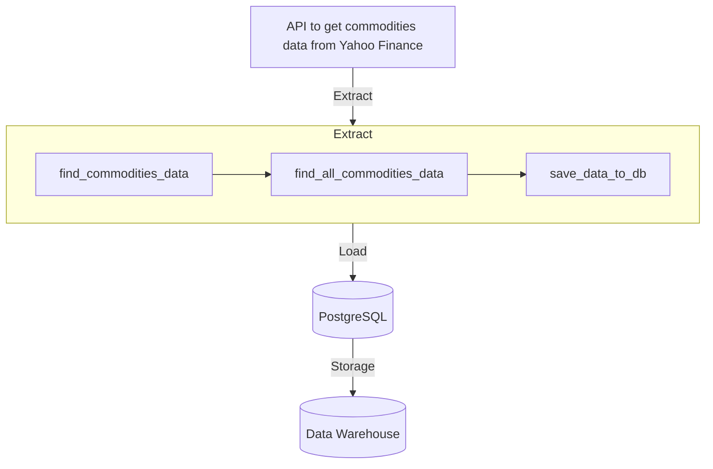
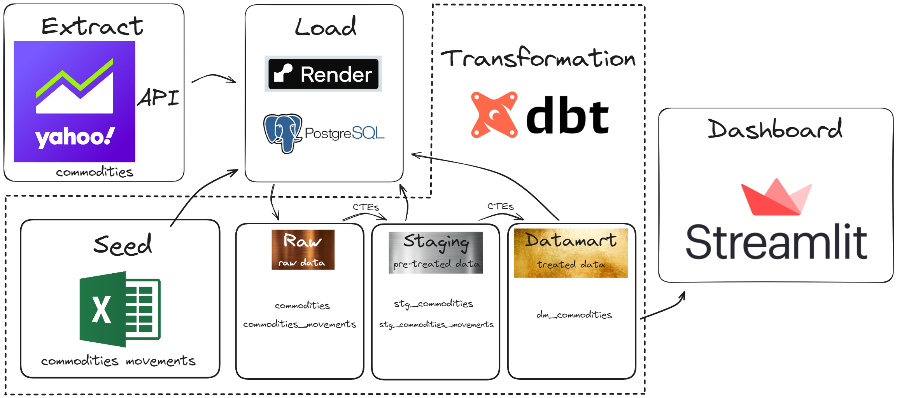

# Data Warehouse from Scratch

This project constructs a Data WareHouse (DW) from the group up to analyze commodity data, enabling data-driven decisions for potentially more profitable commodity trading.

**Key Objectives:**

- **Reduce Manual Work:** automate data extraction, loading, and transformation processes.
- **Enhance Performance:** optimize data storage and retrieval for faster analysis.
- **Simplify Analysis:** utilize SQL for querying and transform data.
- **Promote Reusability:** create modular data models for consistent report and analysis.
- **Drive Profitability:** gain actionable insights to improve the profits.

## Project Architeture

Here are implemented a *ELT (Extract, Load, Transform) process*, integrating *extraction data from APIs and Excel sheets*, *load using `PostgreSQL`*, and *transform using `dbt-core`*. With data in hands, it was constructed a dashboard using the `streamlit`.

### 1. Extract

To start the project, it was used `yfinance` library to extract commodities data from Yahoo Finance API.

### 2. Load

After this, it was built a PostgreSQL database hosted on Render. The connection to database was established using `sqlalchemy` and load commodities data on it. It's needed a `.env` file with database credentials (host, port, name, user, password, schema) to acess database.



### 3. Transform

The data transformation was done using dbt (Data Build Tool) with PostgreSQL integration (`dbt-postgres` library).
dbt-core is a open-source tool that documents your code, test it and use only SQL language to realize the transformations.

Here, it will have three layers of data modelling:

#### Raw:
Raw data extracted from API and loaded from csv file. Seed was used to load into the Data Warehouse commodities movements data.

#### Staging:
Cleaned and prepared data from the raw layer. Views are created for commodities (`stg_commodities.sql`) and commodity movements (`stg_commodities_movements.sql`).

#### Datamart:
Transformed data from the staging layer, optimized for analysis and dashboard construction. Created a unified view from a join between `stg_commodities` and `stg_commodities_movements` (`dm_commodities.sql`).

More information on dbt project is documented [here](/datawarehouse/docs/homepage.md).

```mermaid
graph TD;
    subgraph Transform
        A1[Raw data] --> |commodities| B1[stg_commodities.sql]
        A1 |Seed| --> |commodities_movements| C1[stg_commodities_movements.sql]
        B1 --> D1[dm_commodities.sql]
        C1 --> D1
    end

    A[(Data Warehouse)] --> |Transformation| A1
    Transform --> B[Dashboard]
```

### 4. Dashboard

To construct the dashboard, it'll be used streamlit. First, it's needed to connect with database and acess data from it. With acess to data, it can be done a query and salve result in a dataframe. Now, the dashboard can be constructed and configured whatever you want to.

To run streamlit dashboard app:
```bash
streamlit run app/app.py
```

## Installation

- **1. Clone Repository:**
    ```bash
    git clone <repository-URL>
    cd <repository-name>
    ```

- **2. Create and Activate Virtual Environment (Recommended):**
    ```bash
    python -m venv .venv
    source .venv/Scripts/activate
    ```

- **3. Install Dependencies:**
    Install dependencies with `requirements.txt` in each of the subprojects directories (`src`,`datawarehouse`,`app`)
    ```bash
    pip install -r requirements.txt
    ```

- **4. Database Setup:**
    - Create a PostgreSQL database on a cloud server (Render, AWS, Azure, GCP, etc.).
    - Configure database connection variables in a `.env` file in the project's root directory.

    ```env
    DB_HOST_PROD=<your_db_host>
    DB_PORT_PROD=<your_db_port>
    DB_NAME_PROD=<your_db_name>
    DB_USER_PROD=<your_db_user>
    DB_PASSWORD_PROD=<your_db_pass>
    DB_SCHEMA_PROD=<your_db_schema>
    ```

- **5. Extract and Load Data:**
    ```bash
    python src/extract_load.py
    ```

- **6. dbt Setup:**
    - In your project directory, initialize dbt and configure profile to connect with database (detailed instruction on [dbt documentation](https://docs.getdbt.com/docs/get-started-dbt))

    ```bash
    dbt init
    # Follow prompts to configure tour dbt
    ```

    - To check if everything is right with the connection to database, enter in the directory created and run a debug.

    ```bash
    cd <dbt-directory>
    dbt debug
    ```
- **7. Import csv with dbt:**

    To do seeds, it's need to get in the `seed` directory, has the csv file you want to insert in it, and run dbt:
    ```bash
    cd <dbt-directory>/seed
    dbt seed
    ```

- **8. Run dbt Transformations:**

    Go back to main dbt directory and run dbt to create views from CTEs (`.sql` files):
    ```bash
    cd ..
    dbt run
    ```

- **9. Launch Streamlit Dashboard:**

    Navigate back to project's root directory and starts the Streamlit:
    ```bash
    cd ..
    streamlit run app/app.py
    ```

- **10. Generate Documentation for dbt (Optional)**

    - To create a documentation for dbt project run the dbt docs:
    ```bash
    cd <dbt-directory>
    dbt docs generate
    dbt docs serve
    ```

    - To modify the overview of the project, insert `docs-paths: ["docs"]` in the `dbt_project.yml` file, create  in dbt directory a `docs` directory and a `homepage.md` into it. The `homepage.md` will contain the information you want to documentate for your project, although, the content need to be between:
    ```md
    
    <docs_content>
    
    ```

## Project Structure
```plaintext
├── datawarehouse         # dbt project directory
|   ├── dbt_project.yml
|   ├── requirements.txt
│   ├── docs
|   |   └──homepage.md
│   ├── models
|   |   ├── schema.yml
│   │   ├── staging
│   │   │   ├── stg_commodities.sql
│   │   │   └── stg_commodities_movements.sql
|   |   |   └── schema.yml
│   │   └── datamart
│   │       └── dm_commodities.sql
|   |       └── schema.yml
│   └── seeds
│       └── commodities_movements.csv
├── app                   # Streamlit app directory
│   └── app.py
|   └── requirements.txt
├── src
│   └── extract_load.py
|   └── requirements.txt
├── README.md             # Project documentation
└── pyproject.toml
└── requirements.txt
```

## Libraries Used:
- `pandas`: to create dataframes and transform data.
- `sqlalchemy`: to connect and interact with SQL database.
- `python-dotevn`: to load environment variables fom `.env` files.
- `psycopg2-binary`: to adapt PostgreSQL for Python.
- `yfinance`: to acess financial data from Yahoo Finance.
- `dbt-postgres`: to run dbt adapted to PostgreSQL.
- `streamlit`: to create interactive web applications for datavisualization.


