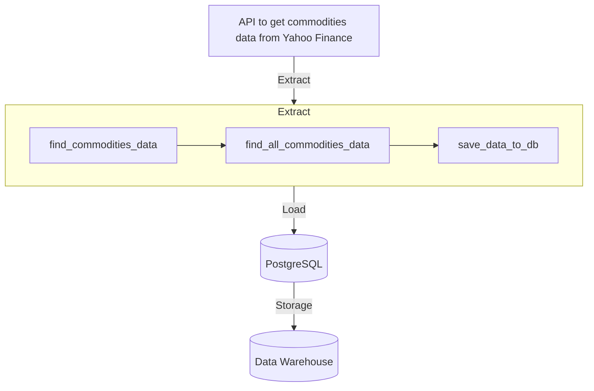

# Data Warehouse from Scratch

Here, I construct a Data WareHouse (DW) to analyse commodity data aiming to reduce manual work, enhance performance, easy to do SQL querys, reuse processing, and most important:

**Make Money For The Company!**

To accomplish that, here are presented a *ELT process*, integrating *APIs to extract data and Excel sheets*, *load using PostgreSQL*, and *transform using dbt-core*. With all this transformed data in hands, it is possible to construct a dashboard using the streamlit.

## 1. Extract

To start the project, it was extracted commodities data from Yahoo Finance's API using the library `yfinance`.

## 2. Load

After this, create a Render server and use `sqlalchemy` to connect to our PostgreSQL database, to load commodities data on it. It's needed a `.env` file with the environment variables (host, port, name, user, password, schema) to link to the database server.

The aforementioned steps are in the script `extract_load.py`. Run this under the `src` folder:
```python
python extract_load.py
```



## 3. Transform

The data transformation will be dneo using dbt, connecting it to database.
dbt-core is a open-source tool that documents your code, test it and use only SQL language to realize the transformations.

To start dbt project it needs to install the library (in our case its integration with postgres):
```bash
pip install dbt-postgres
```

Once installed, initiate the dbt
```bash
dbt init
```
set the enviromental variables and now we have our dbt folders.

To check if everything is right with the database connection, enter in the folder created and run a debug.
```bash
cd datawarehouse
dbt debug
```

Once this, dbt is read to make transformations using CTEs. Here it will has three layers of data:

### Raw:
Raw data extracted from API and seeded from csv file. Seed was used to load into the Data Warehouse commodities movements data. To do seeds, it's need to get in seed folder, has the csv file you want to insert into DW, and run dbt:
```bash
cd <datawarehouse>/seed
dbt seed
```

### Staging:
Pre-treated data cleaned and prepared (renamed, type defined, etc.) from the raw layer. Here I treated both raw tables and created a view for both (`stg_commodities.sql` and `stg_commodities_movements.sql`).

### Datamart:
Treated data from staging layer to do in analyses and construct dashboard. I did a join from both views of staging to construct a unique view with information needed to the analysis (`dm_commodities.sql`).

To create a documentation for dbt project run the dbt docs:
```bash
cd datawarehouse
dbt docs generate
dbt docs serve
```

To modify the overview of the project, insert `docs-paths: ["docs"]` in the `dbt_project.yml` file, create a `docs` folder and a `homepage.md` into it. The `homepage.md` will contain the information you want to documentate for your project, although, the content need to be between:
```md

<docs_content>

```

```mermaid
graph TD;
    subgraph Transform
        A1[Raw data] --> |commodities| B1[stg_commodities.sql]
        A1 |Seed| --> |commodities_movements| C1[stg_commodities_movements.sql]
        B1 --> D1[dm_commodities.sql]
        C1 --> D1
    end

    A[(Data Warehouse)] --> |Transformation| Transform --> B[Dashboard]
```

## 4. Dashboard

To construct the dashboard, it'll be used streamlit. First, it's needed to do the connection with database and acess data from it. With acess to data, it can be done a query and salve result in a dataframe. Now, the dashboard can be constructed and configured whatever you want to.

To run streamlit dashboard app:
```bash
streamlit run app/app.py
```

Libraries:
- pandas: to create dataframes and transform data.
- sqlalchemy: to manipulate the database.
- python-dotevn: to control environment variables.
- psycopg2-binary: to get acess to PostgreSQL with .env.
- yfinance: to acess data from yahoo.
- dbt-postgres:


